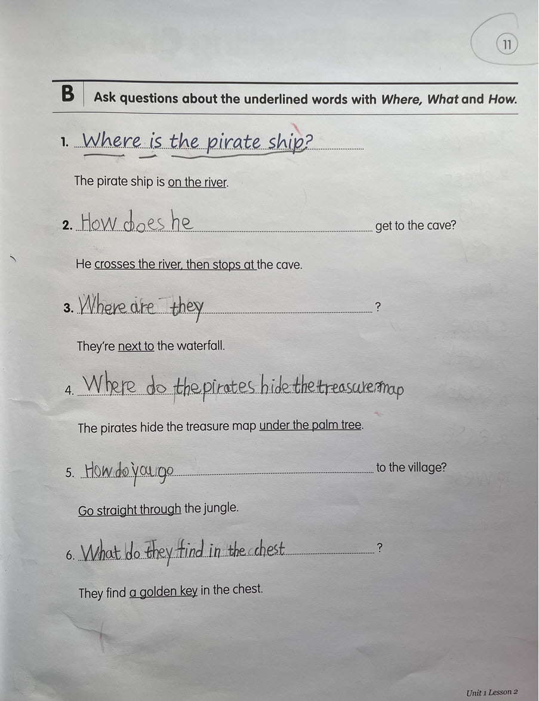

# Crack my son's English exercise using ChatGPT. 

I have a 8 years old, and sometimes I have difficulties to teach him English, e.g., tutor him for his exercise. I thought maybe ChatGPT can help. So, I want to use it to crack my son's English exercise. My initial thought is that ChatGPT can easily complete the task. And, it can prove how AI is great again, and we should keep it away from students, because it may help them to cheat.  
 
And, I'm WRONG! 
 
It took me about *5* hours to write a proper prmopt to get the answers that I expected to the question for only one type of question on the exercise (the code is not perfect). It turns out that you need to give a comprehensive and accurate instructions to ChatGPT to get the answer to the question you expect. To do that, you'll first need to have a fully understanding about the exercise, you probably need to complete some questions first to get to know them. If my son want to "cheat" in this way, I'll persuade him to do it, probably not sharing the code with others for good.  

This my son's English exercise:  

 
Through the coding, I also have some thoughts about ChatGPT or maybe other LLMs as well.  

* First of all, it is not that user friendly if your English is not that good. Because you'll need to use your English words to express your idea or instructions accurately, and pass it to LLMs to process and then get the output expected. Privously, I was concerned that students in English major in some countries will be affected negatively by the increasing usage of LLMs, because you can easily translate almost any language into English using LLMs in pretty good quality. Some jobs related to it will be replaced by LLMs. However, the good news is that the students might find a career to write prompts in English for LLMs.  

* Context matters. For example, if a new user prompt was added to your code before the final prompt, you may end up with a different result. Some of old debugging skills are still applicable here. E.g., change only one thing at a time. 

* It will take time for ChatGPT to understand my prompt for the English exercise (it took about 5 hours). So, I want to apologize to my son for yelling at him while I was tutoring him on English exercise and I thought the answer was so obvious.  
 
After all these, I learned that it's worth to teach 3rd grade students to code on LLMs.  
